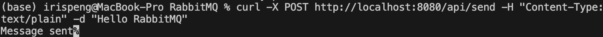
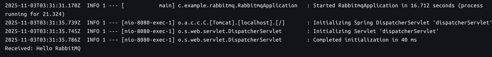

# 🐇 Spring Boot + RabbitMQ + Docker + GitHub Actions (CI/CD)

This project demonstrates a complete workflow for building, testing, packaging, and deploying a Spring Boot application that integrates with RabbitMQ.
The CI/CD pipeline uses GitHub Actions, Docker Hub, and ngrok SSH tunneling to deploy automatically to a local macOS host.

### 🧩 What is ngrok

ngrok is a tunneling tool that lets you securely expose your local machine (like your Mac) to the public internet through a temporary public URL.
It’s especially useful when your local server (e.g., localhost:8080 or SSH port 22) needs to be accessed remotely — for example, by GitHub Actions, mobile apps, or teammates.

With ngrok you can:
- Expose a local HTTP server (e.g., Spring Boot) at http://localhost:8080
- Forward your local SSH port 22 for secure remote access
- Test webhooks, APIs, or CI/CD deployments from external systems
- Avoid opening firewall ports or configuring static IP addresses

#### 🚀 Start an SSH Tunnel

Run this to expose your local SSH service:
```bash
ngrok tcp 22
```

### 1. Start RabbitMQ locally
Install RabbitMQ with Homebrew:
```bash
brew install rabbitmq
brew services start rabbitmq
```
RabbitMQ runs at:
- AMQP: localhost:5672
- Management UI: http://localhost:15672
- (Default username/password: guest / guest)

### 2. Run Spring Boot locally
```bash
./mvnw spring-boot:run -Dspring-boot.run.arguments="--server.port=8081"
```

### 3.Send a test message
Example call:
```bash
curl -X POST http://localhost:8080/api/send -H "Content-Type: text/plain" -d "Hello RabbitMQ"
```


### Example return:
Send message locally:


Message received in the springboot-app container(after CI/CD):



### 4. 🔄 CI/CD Pipeline (GitHub Actions)

Each push to main triggers an automated workflow:
1. Build and test using Maven.
2.	Build a Docker image.
3.	Push the image to Docker Hub.
4.	SSH into macOS (via ngrok).
5.	Pull and restart the container with the latest image.


### 🔐 GitHub Secrets Configuration
Note: 
1. Ngrok hostname and port changes everytime you restart the service.
2. You need to give write access to docker token.

| Name | Description |
|------|--------------|
| **DOCKER_USERNAME** | Your Docker Hub username |
| **DOCKER_PASSWORD** | Docker Hub access token |
| **SERVER_HOST** | ngrok hostname (e.g., `2.tcp.us-cal-1.ngrok.io`) |
| **SERVER_USER** | Local macOS username |
| **SSH_PRIVATE_KEY** | Private key for GitHub Actions to SSH into your Mac |

